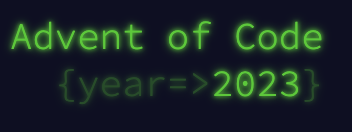
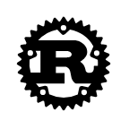

# README
This is a repository to solve the [Advent of Code 2023](https://adventofcode.com/2023).

I'm working with [Rust Programming Lanauage](https://www.rust-lang.org/) to make learning fun.

# Resources
- [Rust Programming Lanauage](https://www.rust-lang.org/)
- [Rust by Example](https://doc.rust-lang.org/rust-by-example/)
- [The Rust Standard Library](https://doc.rust-lang.org/std/index.html)
- [The Cargo Book](https://doc.rust-lang.org/cargo/index.html)
